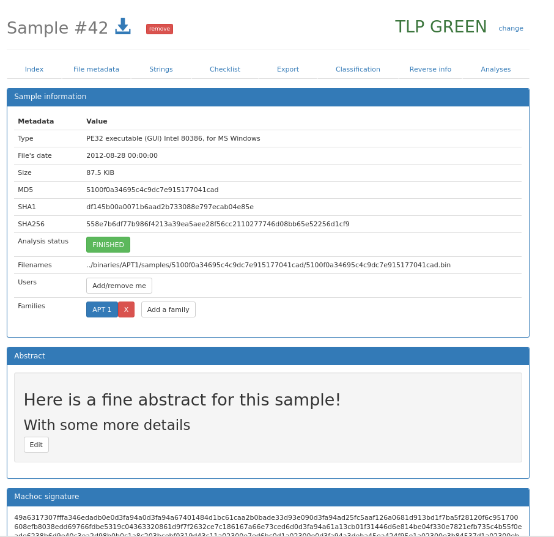
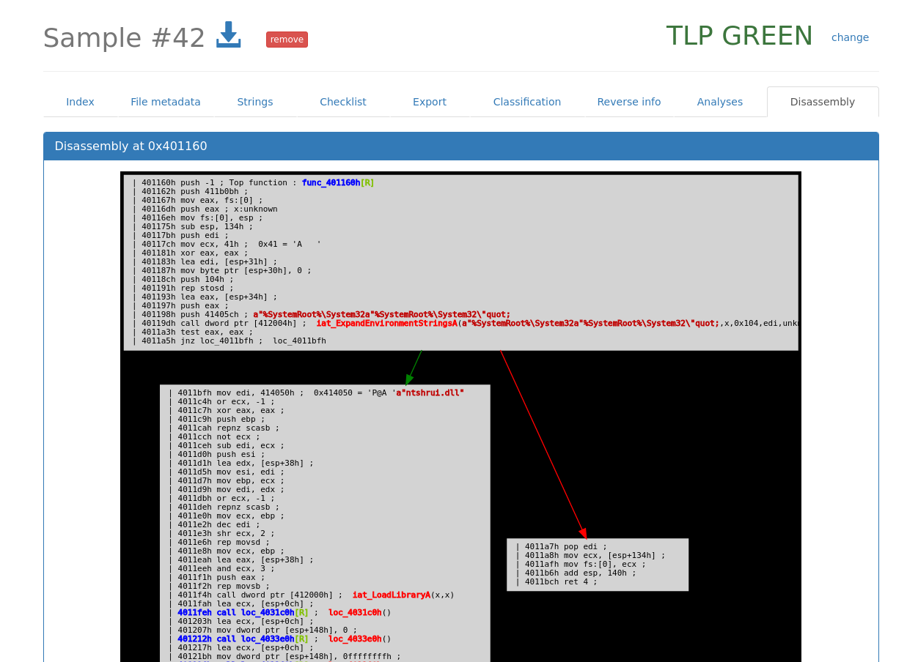
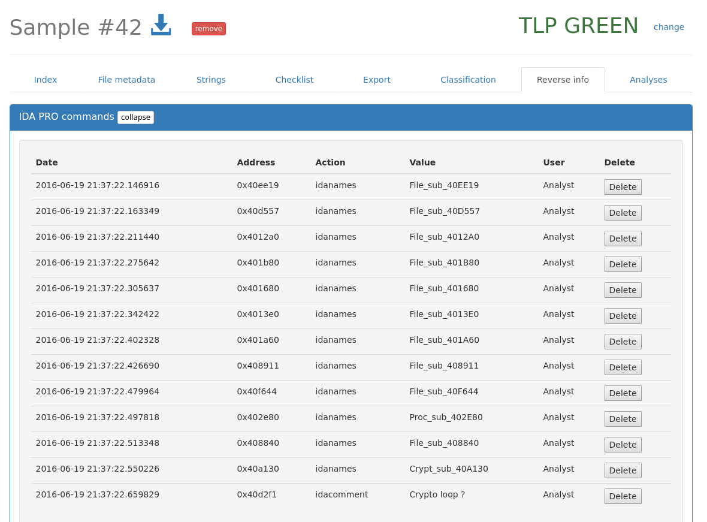
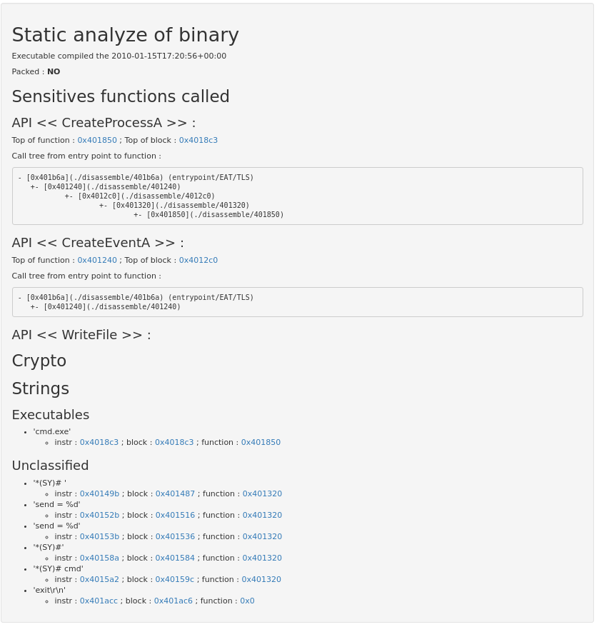
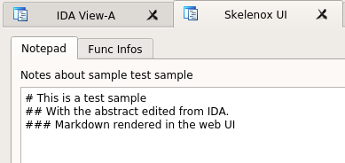

# Polichombr

## What is Polichombr?

This tool aim to provide a collaborative malware analysis framework.

## Documentation

A more detailed documentation is placed in the [docs](https://github.com/ANSSI-FR/polichombr/tree/dev/docs) folder

## Features
* Sample storage and documentation
* Semi automated malware analysis
* IDA Pro collaboration
* Online disassembly
* Binary matching with the [MACHOC](https://github.com/ANSSI-FR/polichombr/blob/dev/docs/MACHOC_HASH.md) fuzzy hash algorithm
* Yara matching

## Installation

Please see the corresponding file in the [docs](https://github.com/ANSSI-FR/polichombr/tree/master/docs) directory

## Example scripts

Scripts under the folder [examples](https://github.com/ANSSI-FR/polichombr/tree/master/examples)
permits some basic actions for a Polichombr instance.

## Screenshots

### Generic sample informations

### Family/Threat overview

### Online disassembly

### Share IDA Pro informations from the WebUI / directly to other users

### Automated hotpoints detection 

### Taking notes right from IDA

## Feature documentation

### Malware analysis

Polichombr provides an engine to automate the analysis tasks by identifying
points of interest inside the malicious binary, and providing them
both on a web interface and inside the analyst's tools via an API.

### Plugins / tasks

Analysis tasks are loaded from the app/controllers/tasks directory, and must inherit from the Task object.
In particular, several tasks are already implemented:

 * AnalyzeIt, a ruby script based on metasm, wich is used to identify interesting points in the binary.
   The goal is to help the analyst by giving hints about where to start. For example,
   we try to identify crypto loops, functions wich calls sensitive API (file, process, network, ...)

 * Peinfo : We load the PE metadata with the peinfo library.
 * Strings : extract ASCII and Unicode strings

### Signatures

We use several signature models to classify malware:

 * Yara
 * imphash
 * Machoc

### Machoc

Machoc is a CFG-based algorithm to classify malware.
For more informations, please refer to the following documentation:
 * [Formal description](https://github.com/ANSSI-FR/polichombr/blob/dev/docs/MACHOC_HASH.md)
 * [Originating paper](https://www.sstic.org/media/SSTIC2016/SSTIC-actes/demarche_d_analyse_collaborative_de_codes_malveill/SSTIC2016-Article-demarche_d_analyse_collaborative_de_codes_malveillants-chevalier_le-berre_pourcelot.pdf)

### IDA Collaboration: Skelenox

This is an IDAPython plugin, wich is used to synchronize the names and comments
with the knowledge base, and with other users database

## Contributing

Contributions are welcome, so please read [CONTRIBUTING.md](https://github.com/ANSSI-FR/polichombr/blob/master/CONTRIBUTING.md)
to have a quick start on how to get help or add features in Polichombr
