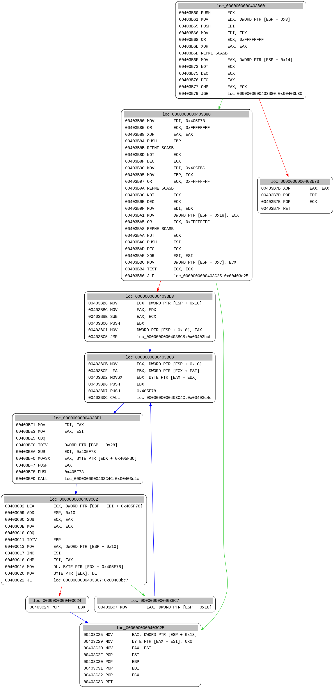
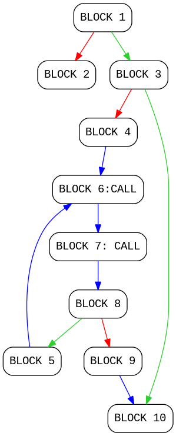

# Machoc hash

The machoc hash is a fuzzy hash mechanism based on the *Call Flow Graph* _(CFG)_ of a function.
This documentation will provide the algorithm specification and some use cases.

## Algorithm specification

1. For each function, the basic blocks composing the CFG should be given ordinal numbers ordered by address.
2. A `call` instruction should split the basic block (to respect the original implementation with `metasm`).
3. Each basic block must be translated in a string of the form `NUMBER:[c,][DST, ...];`

    * `NUMBER` is the basic block number
    * `c,` must added if the basic block contains a call.
    * `DST` is the next  block's number. Each next block numbers must be added and separated with a comma.
    * The line must be terminated by a semicolon.

4. Each block translation should be hashed with a fuzzy hashing function to produce a 32 bits output.
   The reference implementation uses the `Murmurhash3` function.
5. The machoc hash of a binary should be the concatenation of all the machoc hashes of the different functions in the binary.
6. The output for a full binary could include the function address with the corresponding machoc hash.

## Example

To illustrate the algorithm, we will use the call flow graph of a function
composed of 10 basic blocks, with two of them containing a `call` instruction.



### Basic block numbering

Numbering the basic blocks ordered by address give the second graph.



### Basic block translation

Each translated block of the example graph gives the following output.
This output must be concatenated to give a single line.

```
1:2,3;
2:;
3:4,10;
4:6;
5:6;
6:c,7;
7:c,8;
8:5,9;
9:10;
10:;
```

### Final calculation

Hashing the output line with `Murmurhash3` gives the following hash :``0x1014997f``.

## Usage

Machoc hashes are used for several things in the Polichombr platform.

### Binary comparison

Machoc hashes can be used to calculate a similarity match between two samples.
Empiric experiments shows that a 80% Jaccard distance indicated a good match between two binaries.

### Clustering

One can use the machoc matches to create clusters of samples.

### Function matching

Machoc hashes can also be used to diff two samples and rename automatically similar function.
The function matching can be direct (same machoc hash), or based on heuristics.
For example, given two functions in two binaries, if the surrounding functions
in both binaries are direct matched, the two functions are probably similar despite producing a different hash.

## Implementations

Implementations of the *Machoc* algorithm (with some variations) are available for several tools and languages.

### Ruby with ```metasm```

This is the base implementation available in the ```MachocHash``` class in [AnalyzeIt.rb](https://github.com/ANSSI-FR/polichombr/blob/dev/analysis_tools/AnalyzeIt.rb#L174)

### IDAPython

This variant using MD5 instead of Murmurhash3 is available in the [0x00/idadiff](https://github.com/0x00ach/idadiff) repository.

### Radare2

A `Python` and `radare2` implementation is available at [https://github.com/conix-security/machoke/](https://github.com/conix-security/machoke/)
